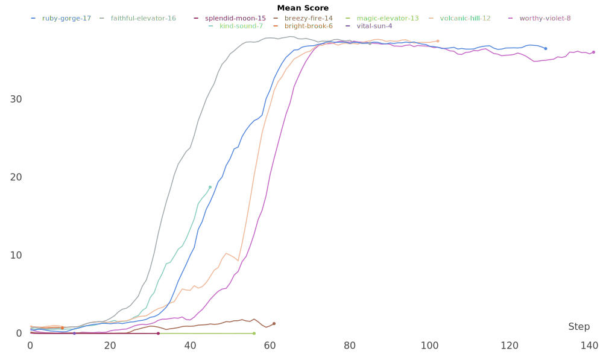

[//]: # (Image References)

[image1]: https://user-images.githubusercontent.com/10624937/43851024-320ba930-9aff-11e8-8493-ee547c6af349.gif "Trained Agent"

# Project 2: Continuous Control

### Introduction

For this project, I've worked with the [Reacher](https://github.com/Unity-Technologies/ml-agents/blob/master/docs/Learning-Environment-Examples.md#reacher) environment.

![Trained Agent][image1]

In this environment, a double-jointed arm can move to target locations. A reward of +0.1 is provided for each step that the agent's hand is in the goal location. Thus, the goal of the agent is to maintain its position at the target location for as many time steps as possible.

The observation space consists of 33 variables corresponding to position, rotation, velocity, and angular velocities of the arm. Each action is a vector with four numbers, corresponding to torque applicable to two joints. Every entry in the action vector should be a number between -1 and 1.

### Distributed Training

In this project, I've used an Unity environment which had:
- 20 identical agents, each with its own copy of the environment.  

### When is this environment solved?

We can say that this environment is solved when we get an average score of +30 (over 100 consecutive episodes, and over all agents).  Specifically,
- After each episode, we add up the rewards that each agent received (without discounting), to get a score for each agent.  This yields 20 (potentially different) scores.  We then take the average of these 20 scores. 
- This yields an **average score** for each episode (where the average is over all 20 agents).

### Getting Started

1. Download the environment from one of the links below.  

    - **_Twenty (20) Agents_**
        - Linux: [click here](https://s3-us-west-1.amazonaws.com/udacity-drlnd/P2/Reacher/Reacher_Linux.zip)
        - Mac OSX: [click here](https://s3-us-west-1.amazonaws.com/udacity-drlnd/P2/Reacher/Reacher.app.zip)
        - Windows (32-bit): [click here](https://s3-us-west-1.amazonaws.com/udacity-drlnd/P2/Reacher/Reacher_Windows_x86.zip)
        - Windows (64-bit): [click here](https://s3-us-west-1.amazonaws.com/udacity-drlnd/P2/Reacher/Reacher_Windows_x86_64.zip)
    
    (_For Windows users_) Check out [this link](https://support.microsoft.com/en-us/help/827218/how-to-determine-whether-a-computer-is-running-a-32-bit-version-or-64) if you need help with determining if your computer is running a 32-bit version or 64-bit version of the Windows operating system.

    (_For AWS_) If you'd like to train the agent on AWS (and have not [enabled a virtual screen](https://github.com/Unity-Technologies/ml-agents/blob/master/docs/Training-on-Amazon-Web-Service.md)), then please use [this link](https://s3-us-west-1.amazonaws.com/udacity-drlnd/P2/Reacher/one_agent/Reacher_Linux_NoVis.zip) (version 1) or [this link](https://s3-us-west-1.amazonaws.com/udacity-drlnd/P2/Reacher/Reacher_Linux_NoVis.zip) (version 2) to obtain the "headless" version of the environment.  You will **not** be able to watch the agent without enabling a virtual screen, but you will be able to train the agent.  (_To watch the agent, you should follow the instructions to [enable a virtual screen](https://github.com/Unity-Technologies/ml-agents/blob/master/docs/Training-on-Amazon-Web-Service.md), and then download the environment for the **Linux** operating system above._)

### Instructions & Things to know

Moste of the documentation is written in: `Continuous_Control(.ipynb|.html)`  
Basically, this project starts at : `PROJECT 2: CONTINUOUS CONTROL!`  
(Therefor you can skip the first 6 cells)  

#### How do you reproduce this project? 
Run the `Continuous_Control.ipynb` from top till bottom to get started with training your own agent! 

#### my results:

I managed to get an average score of +30 between the 36 and 60 steps. Depending on the configuration.  
All the models, hyper-parameters and logs are visible via: [Weights and Biases](https://app.wandb.ai/verbeemen/udacity_deep-reinforcement-learning_project-2?workspace=user-verbeemen).   
(Weights and Biases is a developer tools for deep learning. By adding a couple lines of code, your training script is able to keep track of your hyperparameters, system metrics, and outputs so that you can compare experiments, see live graphs of training, and easily share your findings with colleagues.)

| Agents               | runtime | _step | Average Score | Mean Score | ACTION_SIZE | BATCH_SIZE | TAU    | BUFFER_SIZE | GAMMA | LEARN_INTERVAL | LEARN_NUM | LR_ACTOR | LR_CRITIC | NUM_AGENTS | STATE_SIZE | actor_local  | actor_target | actor_optimizer                                                                                    | critic_local     | critic_target    | critic_optimizer                                                                                   |
|----------------------|---------|-------|---------------|------------|-------------|------------|--------|-------------|-------|----------------|-----------|----------|-----------|------------|------------|--------------|--------------|----------------------------------------------------------------------------------------------------|------------------|------------------|----------------------------------------------------------------------------------------------------|
| ruby-gorge-17        | 29m 26s | 129   | 31.163        | 35.976     | 4           | 512        | 0.0015 | 100000      | 0.99  | 6              | 1         | 0.001    | 0.001     | 20         | 33         | 33-400-300-4 | 33-400-300-4 | Adam ( Parameter Group 0 amsgrad: False betas: (0.9, 0.999) eps: 1e-08 lr: 0.001 weight_decay: 0 ) | 33-400(+4)-300-4 | 33-400(+4)-300-4 | Adam ( Parameter Group 0 amsgrad: False betas: (0.9, 0.999) eps: 1e-08 lr: 0.001 weight_decay: 0 ) |
| faithful-elevator-16 | 25m 18s | 85    | 22.853        | 37.115     | 4           | 512        | 0.0015 | 100000      | 0.99  | 6              | 2         | 0.001    | 0.001     | 20         | 33         | 33-400-300-4 | 33-400-300-4 | Adam ( Parameter Group 0 amsgrad: False betas: (0.9, 0.999) eps: 1e-08 lr: 0.001 weight_decay: 0 ) | 33-400(+4)-300-4 | 33-400(+4)-300-4 | Adam ( Parameter Group 0 amsgrad: False betas: (0.9, 0.999) eps: 1e-08 lr: 0.001 weight_decay: 0 ) |
| splendid-moon-15     | 9m 36s  | 32    | 0.01198       | 0.0035     | 4           | 512        | 0.002  | 100000      | 0.99  | 6              | 2         | 0.001    | 0.001     | 20         | 33         | 33-512-128-4 | 33-512-128-4 | Adam ( Parameter Group 0 amsgrad: False betas: (0.9, 0.999) eps: 1e-08 lr: 0.001 weight_decay: 0 ) | 33-512(+4)-128-4 | 33-512(+4)-128-4 | Adam ( Parameter Group 0 amsgrad: False betas: (0.9, 0.999) eps: 1e-08 lr: 0.001 weight_decay: 0 ) |
| breezy-fire-14       | 16m 39s | 61    | 0.7036        | 1.954      | 4           | 512        | 0.001  | 100000      | 0.99  | 4              | 1         | 0.001    | 0.001     | 20         | 33         | 33-384-256-4 | 33-384-256-4 | Adam ( Parameter Group 0 amsgrad: False betas: (0.9, 0.999) eps: 1e-08 lr: 0.001 weight_decay: 0 ) | 33-384(+4)-256-4 | 33-384(+4)-256-4 | Adam ( Parameter Group 0 amsgrad: False betas: (0.9, 0.999) eps: 1e-08 lr: 0.001 weight_decay: 0 ) |
| magic-elevator-13    | 12m 53s | 56    | 0.01293       | 0.0065     | 4           | 512        | 0.0015 | 100000      | 0.99  | 8              | 1         | 0.001    | 0.001     | 20         | 33         | 33-512-256-4 | 33-512-256-4 | Adam ( Parameter Group 0 amsgrad: False betas: (0.9, 0.999) eps: 1e-08 lr: 0.001 weight_decay: 0 ) | 33-512(+4)-256-4 | 33-512(+4)-256-4 | Adam ( Parameter Group 0 amsgrad: False betas: (0.9, 0.999) eps: 1e-08 lr: 0.001 weight_decay: 0 ) |
| volcanic-hill-12     | 27m 11s | 102   | 19.732        | 37.626     | 4           | 512        | 0.001  | 100000      | 0.99  | 4              | 1         | 0.001    | 0.001     | 20         | 33         | 33-512-256-4 | 33-512-256-4 | Adam ( Parameter Group 0 amsgrad: False betas: (0.9, 0.999) eps: 1e-08 lr: 0.001 weight_decay: 0 ) | 33-512(+4)-256-4 | 33-512(+4)-256-4 | Adam ( Parameter Group 0 amsgrad: False betas: (0.9, 0.999) eps: 1e-08 lr: 0.001 weight_decay: 0 ) |
| worthy-violet-8      | 36m 39s | 141   | 31.319        | 36.566     | 4           | 512        | 0.0025 | 100000      | 0.99  | 4              | 1         | 0.001    | 0.001     | 20         | 33         | 33-512-256-4 | 33-512-256-4 | Adam ( Parameter Group 0 amsgrad: False betas: (0.9, 0.999) eps: 1e-08 lr: 0.001 weight_decay: 0 ) | 33-512(+4)-256-4 | 33-512(+4)-256-4 | Adam ( Parameter Group 0 amsgrad: False betas: (0.9, 0.999) eps: 1e-08 lr: 0.001 weight_decay: 0 ) |
| kind-sound-7         | 11m 5s  | 45    | 5.749         | 20.812     | 4           | 512        | 0.002  | 100000      | 0.99  | 6              | 1         | 0.001    | 0.001     | 20         | 33         | 33-400-300-4 | 33-400-300-4 | Adam ( Parameter Group 0 amsgrad: False betas: (0.9, 0.999) eps: 1e-08 lr: 0.001 weight_decay: 0 ) | 33-400(+4)-300-4 | 33-400(+4)-300-4 | Adam ( Parameter Group 0 amsgrad: False betas: (0.9, 0.999) eps: 1e-08 lr: 0.001 weight_decay: 0 ) |
| bright-brook-6       | 2m 9s   | 8     | 0.757         | 0.499      | 4           | 512        | 0.002  | 100000      | 0.99  | 6              | 1         | 0.001    | 0.001     | 20         | 33         | 33-400-300-4 | 33-400-300-4 | Adam ( Parameter Group 0 amsgrad: False betas: (0.9, 0.999) eps: 1e-08 lr: 0.001 weight_decay: 0 ) | 33-400(+4)-300-4 | 33-400(+4)-300-4 | Adam ( Parameter Group 0 amsgrad: False betas: (0.9, 0.999) eps: 1e-08 lr: 0.001 weight_decay: 0 ) |
| vital-sun-4          | 3m 58s  | 11    | 0.01508       | 0.018      | 4           | 512        | 0.001  | 100000      | 0.99  | 6              | 2         | 0.001    | 0.001     | 20         | 33         | 33-512-256-4 | 33-512-256-4 | Adam ( Parameter Group 0 amsgrad: False betas: (0.9, 0.999) eps: 1e-08 lr: 0.001 weight_decay: 0 ) | 33-512(+4)-256-4 | 33-512(+4)-256-4 | Adam ( Parameter Group 0 amsgrad: False betas: (0.9, 0.999) eps: 1e-08 lr: 0.001 weight_decay: 0 ) |

#### Project folder structure.
- checkoints
  - The weights of the actor and cretic networks
- files
  - agent.py
  - model_actor.py
  - model_critic.py
  - ouNoise.py
  - replayBuffer.py
- images
  - images used in Continuous_Control.ipynb report
- wandb
  - contains logging files
- Continuous_Control.ipynb (the report)
- Continuous_Control.html  (the report)
- hyper_parameters.json    (a json which contains the hyperparameters)

#### Python dependencies
Python packages which were used in this project
- python 3.7
- jupyter
- unityagents
- pytorch
- numpy
- collections
- wandb
    
